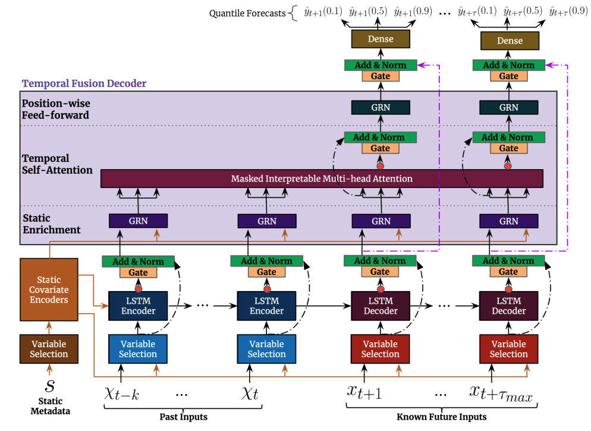

# Demand Forecasing using Deep Neural Networks

## Time Series Demand Forecasing using Deep Learning

The purpose of this repo is to predict stock keeping unit (SKU) (aka product) based on historical data. The forcasting horizon is up to six months ahead. 
The model inputs are:
-	Historical sales data
-   Sales price
-	Calendar information
-	Store location
-	Overall sales data

More information about the dataset could be found [here](https://www.kaggle.com/utathya/future-volume-prediction).

The deep neural network used in this analysis is the Temporal Fusion Transformer.

The code also provides some basic steps for data preprocessing as well as data visualisation.

## Future Work

- [ ] Benchmarking against Xgboost
- [ ] Hyper-parameter tuning

## References 
--------------
https://pytorch-forecasting.readthedocs.io/en/stable/
https://pytorch-forecasting.readthedocs.io/en/latest/tutorials/stallion.html#Train-the-Temporal-Fusion-Transformer